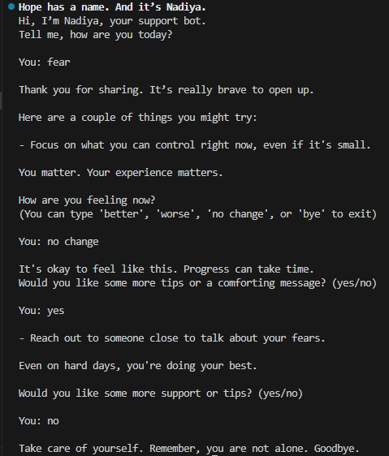

# Nadiya ChatBot - A Companion of Hope

**Nadiya** is a terminal-based emotional support chatbot built to help individuals navigating stress, grief, fear, or uncertainty. Specifically in the context of war or displacement. Through meaningful affirmations and emotion-specific coping tips, Nadiya provides comfort, encouragement, and a safe space to check in with yourself.

---

## Features

- Emotional check-in with words like: `fear`, `grief`, `hopelessness`, `anger`, `displacement`, `anxiety`, and `resilience`
- Randomized affirmations to encourage mental strength and self-kindness
- Emotion-specific advice and coping strategies
- Slow, animated text for a calming and human-like experience
- A conversational loop that evolves with the user's feelings

---

## 🖼️ Demo

  
*Example interaction showing emotional input and support responses*

---
